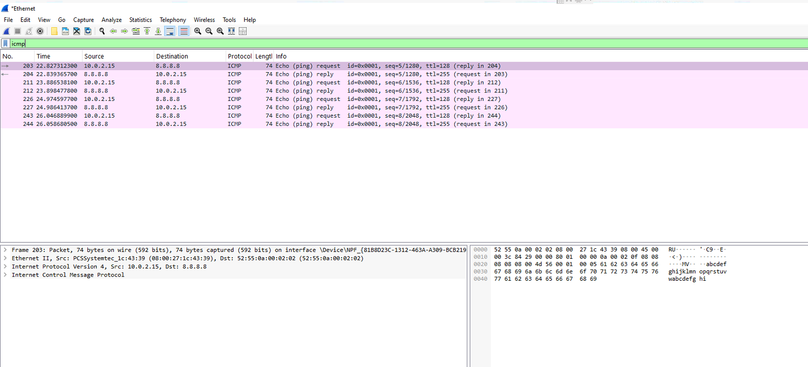
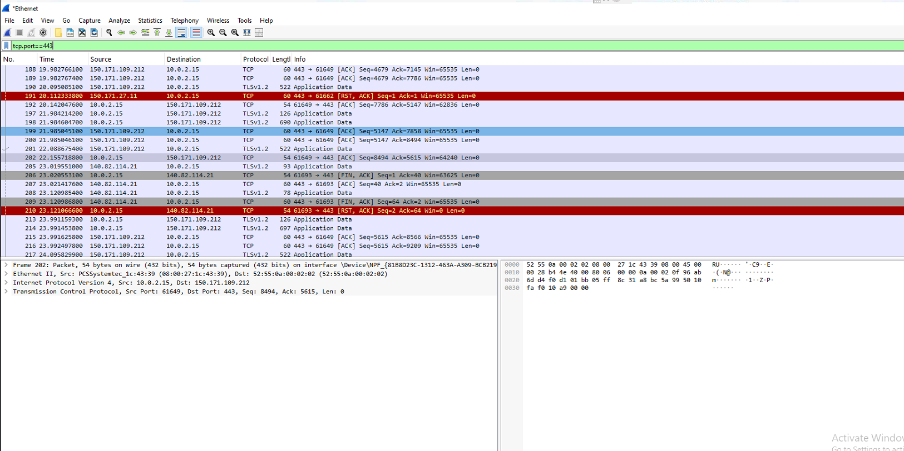
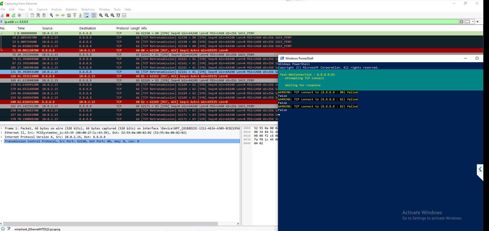

# network-traffic-analysis-lab
Wireshark-based network traffic analysis lab focused on DNS, ICMP, TCP/TLS inspection, port scan detection, and security investigation reporting.

Network Traffic Analysis Lab focused on packet inspection, protocol analysis, and detection of suspicious network activity using Wireshark.

This project demonstrates the investigation of normal network communications and anomalous activity through DNS, ICMP, TCP/TLS, and port scan analysis.

## Investigation Report

Full report available here:

[Network Traffic Analysis Report](reports/network-traffic-analysis-report.md)

## Skills Demonstrated

- Network Traffic Analysis
- Packet Inspection
- Wireshark Analysis
- DNS Investigation
- TCP/IP Analysis
- ICMP Analysis
- Port Scan Detection
- Network Reconnaissance Detection
- Security Monitoring
- Incident Investigation
- Technical Documentation

  ## Investigation Workflow

1. Capture live network traffic using Wireshark
2. Identify normal DNS traffic and hostname resolution
3. Analyse ICMP echo requests and responses
4. Examine encrypted HTTPS/TLS communications
5. Simulate reconnaissance activity using PowerShell
6. Detect and analyse TCP port scanning behaviour
7. Document findings and security implications
8. Produce investigation report

## DNS Analysis

## ICMP Analysis

## HTTPS Traffic Analysis

## Port Scan Detection

## Author

Matt Stokes

Aspiring SOC Analyst | IT Support Technician | Cybersecurity Enthusiast

GitHub: https://github.com/MS241290
