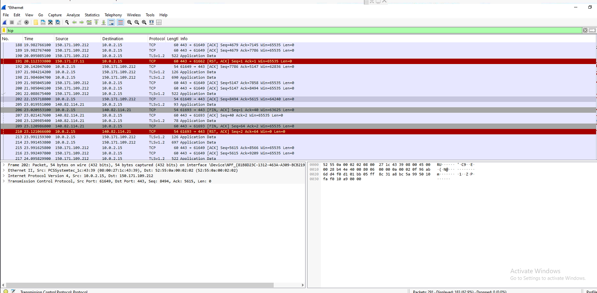
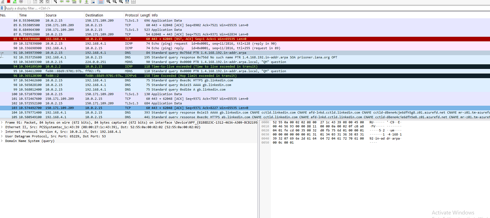
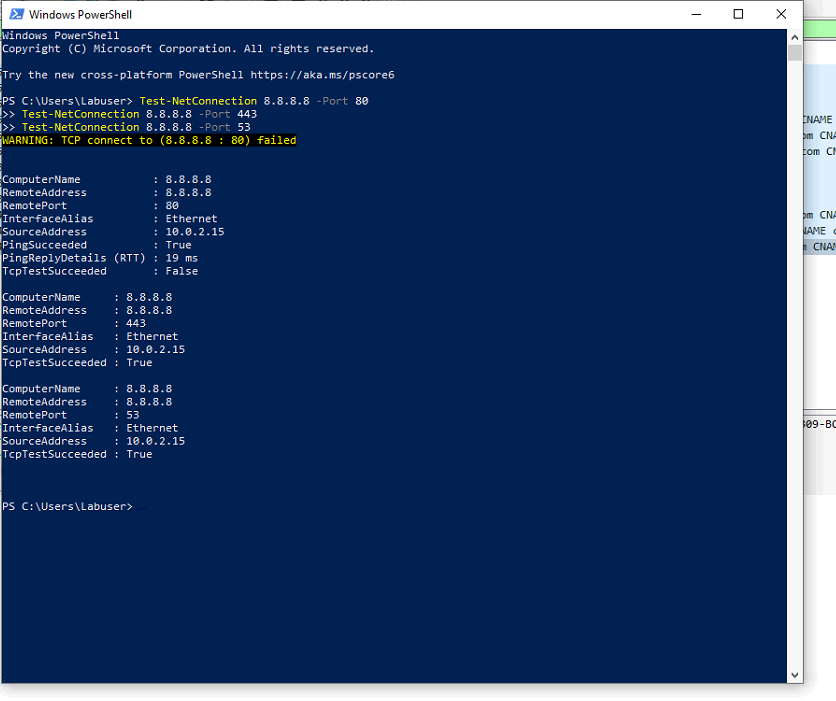

# network-traffic-analysis-lab
Wireshark-based network traffic analysis lab focused on DNS, ICMP, TCP/TLS inspection, port scan detection, and security investigation reporting.

Network Traffic Analysis Lab focused on packet inspection, protocol analysis, and detection of suspicious network activity using Wireshark.

This project demonstrates the investigation of normal network communications and anomalous activity through DNS, ICMP, TCP/TLS, and port scan analysis.

## Investigation Report

Full report available here:

[Network Traffic Analysis Report](reports/network-traffic-analysis-report.md)

## DNS Query Analysis

Normal DNS queries were captured and analysed using Wireshark. Traffic showed successful name resolution requests and responses between the client and DNS server.

## ICMP Traffic Analysis

ICMP echo requests and replies were generated using ping. The capture confirmed successful connectivity and demonstrated how ICMP traffic appears within Wireshark.

## HTTPS Traffic Analysis

Encrypted HTTPS traffic was observed over TCP port 443. TLS sessions and application data packets were identified, demonstrating secure web communication.

## Normal Web Traffic

Routine web browsing activity was captured to establish a baseline of normal network behaviour.

## Web Traffic Analysis

Web traffic was inspected to identify common protocols, destination hosts, and communication patterns.

## TCP Port Connectivity Testing

PowerShell Test-NetConnection was used to verify connectivity to specific TCP ports. Successful and failed connection attempts were observed and analysed.

## Port Scan Detection

Repeated SYN packets targeting multiple ports were generated and captured in Wireshark. This activity resembles reconnaissance behaviour commonly seen during port scanning and demonstrates how suspicious network activity can be identified.

## Skills Demonstrated

- Network Traffic Analysis
- Packet Inspection
- Wireshark Analysis
- DNS Investigation
- TCP/IP Analysis
- ICMP Analysis
- Port Scan Detection
- Network Reconnaissance Detection
- Security Monitoring
- Incident Investigation
- Technical Documentation

  ## Investigation Workflow

1. Capture live network traffic using Wireshark
2. Identify normal DNS traffic and hostname resolution
3. Analyse ICMP echo requests and responses
4. Examine encrypted HTTPS/TLS communications
5. Simulate reconnaissance activity using PowerShell
6. Detect and analyse TCP port scanning behaviour
7. Document findings and security implications
8. Produce investigation report

## Author

Matt Stokes

Aspiring SOC Analyst | IT Support Technician | Cybersecurity Enthusiast

GitHub: https://github.com/MS241290
