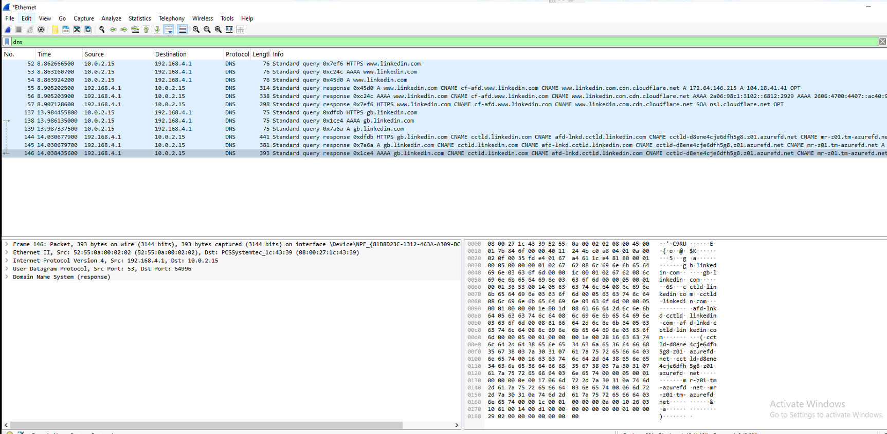

# Network Traffic Analysis Report

## Date

03/06/2026

## Analyst

Matt Stokes

## Objective

Capture and analyse network traffic using Wireshark to identify normal network communications and investigate suspicious network activity.

## Environment

* Windows 10 Virtual Machine
* Oracle VirtualBox
* Wireshark 4.x
* PowerShell

## Tools Used

* Wireshark
* PowerShell
* Windows Networking Utilities

## DNS Analysis

DNS traffic was captured and analysed to observe domain name resolution activity. Queries and responses were inspected to identify normal DNS behaviour and associated IP address resolution.

### Findings

* DNS requests sent to configured DNS server.
* Successful responses received.
* Domain resolution observed for web services.

## ICMP Analysis

ICMP Echo Requests and Echo Replies were generated using ping commands.

### Findings

* Successful communication with external hosts.
* Round-trip responses confirmed network connectivity.
* ICMP traffic clearly identifiable within Wireshark captures.

## HTTPS Traffic Analysis

Encrypted web traffic was generated by browsing internet resources and inspected within Wireshark.

### Findings

* TLS-encrypted communications observed over TCP port 443.
* Application data visible but encrypted.
* Successful TCP session establishment observed.

## TCP Port Connectivity Testing

PowerShell Test-NetConnection was used to test connectivity to multiple TCP ports.

### Findings

* Successful connection to TCP/443.
* Failed connections observed on restricted ports.
* Corresponding TCP traffic captured within Wireshark.

## Port Scan Detection

Simulated reconnaissance activity was generated using repeated TCP connection attempts against multiple ports.

### Findings

* Multiple SYN packets observed.
* Repeated connection failures identified.
* Behaviour consistent with network reconnaissance and port scanning activity.

## Security Implications

Port scanning is commonly used by attackers to identify exposed services and potential attack surfaces. Early identification of reconnaissance activity can support detection and response efforts before exploitation occurs.

## Conclusion

This investigation demonstrated the ability to capture, analyse, and interpret network traffic using Wireshark. Normal DNS, ICMP, TCP, and HTTPS communications were successfully identified, while simulated reconnaissance activity was detected and documented through packet-level analysis.

